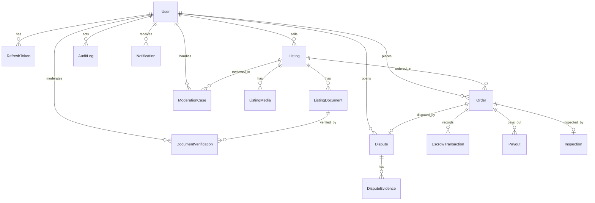

# Purrfect Database ERD

```mermaid
erDiagram
  User ||--o{ RefreshToken : has
  User ||--o{ Listing : sells
  User ||--o{ Order : places
  User ||--o{ DocumentVerification : moderates
  User ||--o{ ModerationCase : handles
  User ||--o{ Dispute : opens
  User ||--o{ AuditLog : acts
  User ||--o{ Notification : receives

  Listing ||--o{ ListingMedia : has
  Listing ||--o{ ListingDocument : has
  Listing ||--o{ Order : ordered_in
  Listing ||--o{ ModerationCase : reviewed_in

  ListingDocument ||--o{ DocumentVerification : verified_by

  Order ||--o{ EscrowTransaction : records
  Order ||--o{ Payout : pays_out
  Order ||--o| Inspection : inspected_by
  Order ||--o| Dispute : disputed_by

  Dispute ||--o{ DisputeEvidence : has
```

